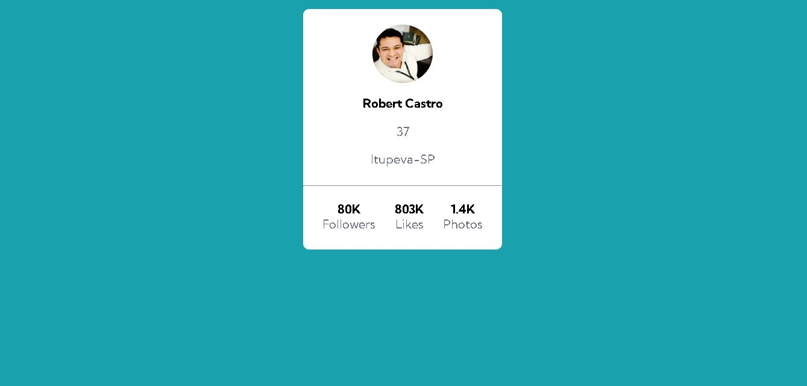
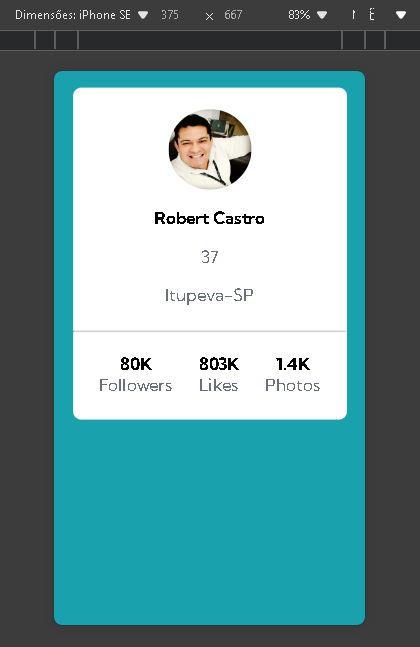

## <h1>Exercício HTML + CSS Avançado - Profile Card</h1>

 

## Font family para ser usada no projeto:

- `Family: [Kumbh Sans](https://fonts.google.com/specimen/Kumbh+Sans)`
- `Weights: 400, 700`
  
## Cores para utilização:

`--background-color: hsl(185, 75%, 39%);`
`--text-color: hsl(227, 10%, 46%);`

## Tecnologias Utilizadas

`- HTML5`
`- CSS3`
`- FontAwesome`

## Layout esperado para desktop:

  <a href="https://github.com/RobertCastro86">
    

## Layout esperado para mobile:

  <a href="https://github.com/RobertCastro86">
    

